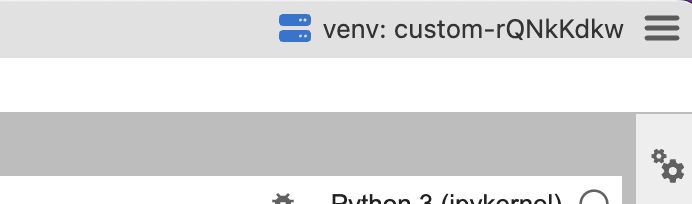

# Ambiente de Data Science

Configurações e scripts para montar um ambiente para trabalho de data science controlado.

É um ambiente que funciona muito bem junto com o [Jupyter Desktop](https://github.com/jupyterlab/jupyterlab-desktop). 

## Informações técnicas

Para todar o ambiente instale o pipenv e a versão 3.11 do Python.

Se nao tiver a versão 3.11 do Python disponivel no seu ambinte Linux, Windows ou MacOS use o [Pyenv](https://github.com/pyenv/pyenv) para gerenciar as versões.

### Dependencias

* pipenv

### Scripts

**Para criar o ambiente rode:**

    pipenv install 

**Para rodar o jupyterlab via browser**

    pipenv run lab

**Para rodar o Jupyter Desktop**

Depois de criar o ambiente, quando abrir a pagina de Welcome do Juyter Desktop, crie um novo ambiente no Desktop e, configure, no canto superior direito da janela, o ambiente virtual que deseja utilizar. Selecione o path do seu virtualenv criado pelo pipenv

